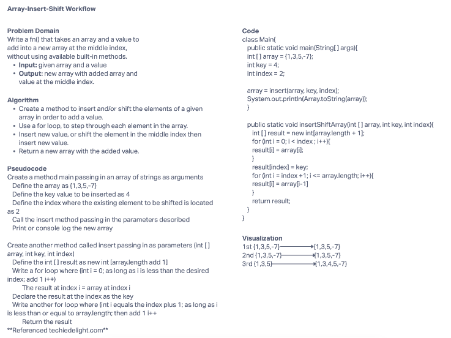

# Insert to Middle of an Array
The challenge was to shift an element one index over and insert a new value where the that shifted element was. To accomplish this, a method needed to be wriiten called insertShiftArray, passing in a given array and a value. Use a for loop to to iterate through the array until arriving at the index to be shift and insert the value in that index.
## Whiteboard Process

## Approach & Efficiency
I tackled today's challenge by mapping out the problem domain and then the alogrithm. As I completed these portions, the steps necessary to write the code were still not clear. After some research, writing the pseudocode and code became clear. This helped draw out the visualization of what the code is intended to do. I still don't understand Big O, it is something I need to do further research on.
