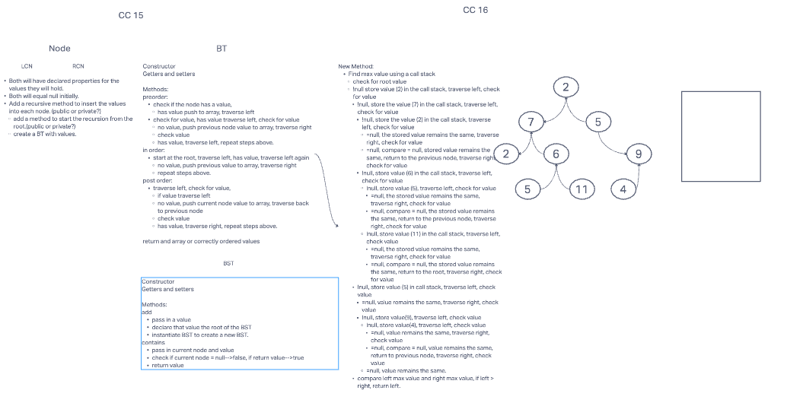

# Trees
<!-- Short summary or background information -->

## Challenge
<<<<<<< Updated upstream
The challenge was to create three classes(Node, BT, and BST). BT class required the depth first traversal methods (preorder, inorder, and postorder) and the BST class is a subclass of the BT class, and requires the the add and contains methods. The BT class will return an array of appropriately ordered values, while the BST will add a new node with value, and

=======
The challenge was to create three classes(Node, BT, and BST). BT class required the depth first traversal methods (preorder, inorder, and postorder) and the BST class is a subclass of the BT class, and requires the the add and contains methods. The BT class will return an array of appropriately ordered values, while the BST will add a new node with value, and use the contains method to check for value, return true if present, false if not.git stat

6 September 2022
Today's challenge is to find the max value in the binary tree, using preOrder traversal and findMaxValue methods.
## Whiteboard

>>>>>>> Stashed changes
## Approach & Efficiency
<!-- What approach did you take? Why? What is the Big O space/time for this approach? -->

<<<<<<< Updated upstream
## API
<!-- Description of each method publicly available in each of your trees -->
=======
6 September 2022
findMaxValue - public void, designed to find the max value a the binary tree.

BST public methods:
add - this method will add a new node with value
contains - this method will return a boolean of true, if the node contains a value.
>>>>>>> Stashed changes
