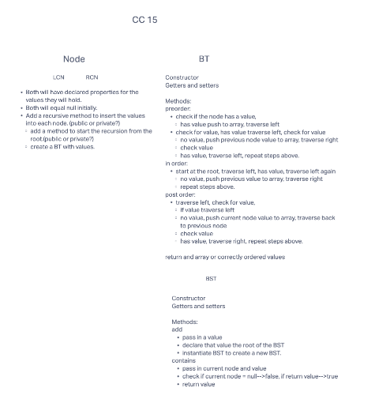

# Trees
A tree is made up of various things called nodes, connected by edges. Each node has a value or piece of data within, and it might or might not have a child node. The root of the tree is the very first node. In this app we are using the Binary Tree and the Binary Search Tree. The difference between the two, is that one is sorted and the other is not.
## Challenge
The challenge was to create three classes(Node, BT, and BST). BT class required the depth first traversal methods (preorder, inorder, and postorder) and the BST class is a subclass of the BT class, and requires the the add and contains methods. The BT class will return an array of appropriately ordered values, while the BST will add a new node with value, and use the contains method to check for value, return true if present, false if not.git stat
## Whiteboard

## Approach & Efficiency
I began by drawing up a domain model. I then used the model to begin coding. I used the built in "generate" to generate the constructors and getters and setters for each class. As I began writing the code I realized that I wanted to implement generics. As I am implementing the generics, I am running into some issues. I did some research and found something about Comparables. I didn't quite understand it, so I didn't quite understand it so, I commented it out, and reverted to primitives. The code is not yet finished, but I have been referencing Baeldung and GFG. I am currently stuck in the methods of the BT.
## API
BT public methods:
preOrder - it is public void and designed to traverse through the BT, first logic, then left, then right, finally push value to an array if no node is found.
inOrder - public void, traverse left, then logic, then right, push value to an array if no node is found.
postOrder - public void, traverse left, then right, then logic, push value to an array if no node is found.

BST public methods:
add - this method will add a new node with value
contains - this method will return a boolean of true, if the node contains a value.

