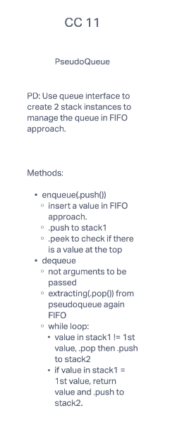

# Challenge Summary
In this challenge, we had to create a pseudoqueue using two stacks to create and manage the queue. We then had to create an enqueue and dequeue method

## Whiteboard Process

## Approach & Efficiency
I started out by creating a domain model. After I finished the model I began to write the code, using my domain model for reference. As I was writing the code, I realized that there was an expectation of an existing file, which I did not have, CC10. I ask Ben for help to get back on track. I was not able to complete the code for "Queue", from CC10, due to time. I did complete this lab, with errors. 31 August, I was able to correct the errors with help from Ben.

## Solution
In order to get through the queue using the two stacks, you have instantiate two stacks. One will serve to push values(stack2) in that are not the next in line, the other(stack1) will store all the values. We start by pushing values into stack1(enqueue). Once we have queued all the values, we begin to traverse through stack1. As we traverse through stack1, if the value did not match the first value to be received, it was popped off and pushed into stack2, in order to keep reference. If the value matched the first value in the queue that value was returned. Once we have traversed through stack1, we checked to see if it was empty, using the method isEmpty. If empty, it returned true, if not, false.
